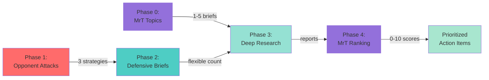
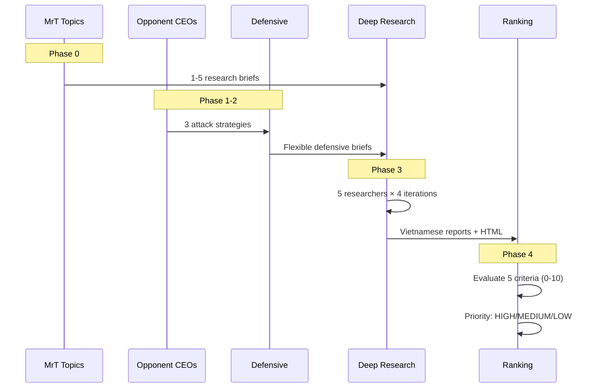

# Competitive Intelligence & Defensive Strategy Workflow

## Overview

This document describes the **Complete Strategic Intelligence Workflow** implemented in the deep research system. The workflow simulates real-world competitive dynamics with FOUR phases:

1. **MrT Topic Generation** - MoMo CEO generates strategic research briefs from market analysis (configurable: 1-5 briefs)
2. **Opponent CEO Attacks** - ZaloPay/VNPay CEOs analyze MoMo to generate exploitation strategies (3 strategies each)
3. **Mr Tường Defensive Response** - MoMo CEO reads attacks and generates defensive research briefs (flexible count)
4. **Deep Research Execution** - Comprehensive research on ALL briefs (MrT topics + defensive briefs)
5. **MrT Report Ranking** - MoMo CEO rates each final report 0-10 for strategic value

## Workflow Architecture



## Phase Overview

### Phase 0: MrT Topic Generation
- **Agent**: MrT (MoMo CEO)
- **Purpose**: Analyze market trends → Generate strategic research briefs
- **Output**: 1-5 research briefs (period-dependent: D/W/M/Q/Y)
- **File**: `.output/mrT_topics_*.md`

### Phase 1: Opponent CEO Attacks
- **Agents**: ZaloPay CEO / VNPay CEO
- **Purpose**: Analyze MoMo weaknesses → Generate exploitation strategies
- **Tools**: `query_momo_data`, `tavily_search`, `think_tool`
- **Output**: 3 executive exploitation plans
- **File**: `.output/opponent_{ceo_type}_attacks_*.md`

### Phase 2: Mr Tường Defensive Response
- **Agent**: Mr Tường (MoMo CEO)
- **Purpose**: Read opponent attacks → Generate defensive research briefs
- **Key Feature**: Flexible brief count (NOT 1-to-1 mapping)
- **Output**: Defensive research briefs (quality over quantity)
- **File**: `.output/mrt_defensive_vs_{opponent}_*.md`

### Phase 3: Deep Research Execution
- **System**: DeepResearch (Clarifier → Supervisor → 5 Researchers → Report Writer → Insight Generator)
- **Purpose**: Execute comprehensive research on ALL briefs (MrT topics + defensive briefs)
- **Output**: Vietnamese research reports + HTML insights
- **Files**: `reports/*.md`, `reports/htmls/*.html`

### Phase 4: MrT Report Ranking
- **Agent**: MrT (MoMo CEO)
- **Purpose**: Evaluate all research reports for strategic value
- **Criteria**: 5 dimensions (0-10 each) → Overall score → Priority (HIGH/MEDIUM/LOW)
- **Output**: Ranked report list with justifications and recommendations
- **File**: `.output/mrt_rankings_*.md`

## Data Flow



## Running the Complete Pipeline

```bash
# Full 5-phase workflow
python -m src.agents.topics_generator              # Phase 0: Generate MrT topics
python -m src.agents.opp_ceo_agent_topic_generator # Phase 1: Opponent attacks
python -m src.agents.mrt_defensive_agent           # Phase 2: Defensive briefs
python main.py                                      # Phase 3: Deep research
python -m src.agents.mrt_ranking_agent             # Phase 4: Rank reports

# Or use automated pipeline for Phase 0+3
python -m src.agents.mrw_explorer Y                # MrT topics → Deep research (5 briefs)
python -m src.agents.mrt_ranking_agent             # Then rank the reports
```

## Key Design Principles

1. **Realistic Competitive Dynamics**: Opponents exploit weaknesses, Mr Tường prioritizes strategically (not 1-to-1)
2. **Data-Driven Intelligence**: Real MoMo data + market research + strategic synthesis
3. **CEO Persona Authenticity**: Distinct backgrounds, strategies, and competitive advantages
4. **Flexible Output**: Adaptive brief counts based on strategic importance
5. **Quality over Quantity**: Focus on actionable insights, not volume

## File Organization

```
.output/                          # Agent outputs
├── mrT_topics_*.md              # MrT research briefs
├── opponent_{ceo}_attacks_*.md  # Opponent exploitation plans
├── mrt_defensive_vs_*.md        # Defensive briefs
├── mrt_rankings_*.md            # Report rankings
└── logs/                        # Debug logs (optional)

reports/                          # Final research outputs
├── *.md                         # Vietnamese reports
└── htmls/*.html                 # Interactive insights
```

## Related Documentation

- [Refactoring Summary](./refactoring_summary.md) - Base class architecture
- [CLAUDE.md](../CLAUDE.md) - Complete system overview
- [MrT Generator](./MrT_generator.md) - MrT persona documentation
- [CEO Persona Prompts](../src/prompts/persona_prompts.py) - All CEO prompt templates
