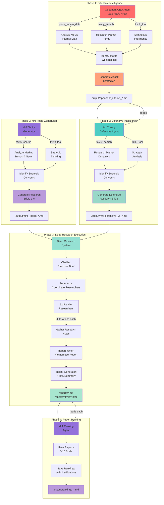
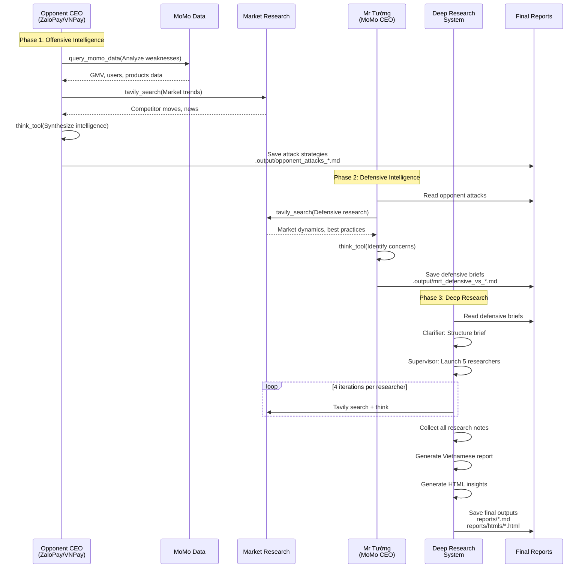

# Competitive Intelligence & Defensive Strategy Workflow

## Overview

This document describes the **Complete Strategic Intelligence Workflow** implemented in the deep research system. The workflow simulates real-world competitive dynamics with FOUR phases:

1. **MrT Topic Generation** - MoMo CEO generates strategic research briefs from market analysis (configurable: 1-5 briefs)
2. **Opponent CEO Attacks** - ZaloPay/VNPay CEOs analyze MoMo to generate exploitation strategies (3 strategies each)
3. **Mr Tường Defensive Response** - MoMo CEO reads attacks and generates defensive research briefs (flexible count)
4. **Deep Research Execution** - Comprehensive research on ALL briefs (MrT topics + defensive briefs)
5. **MrT Report Ranking** - MoMo CEO rates each final report 0-10 for strategic value

## Workflow Architecture



## Detailed Phase Breakdown

### Phase 0: MrT Topic Generation (Strategic Research Briefs)

**Purpose**: MoMo CEO analyzes market trends to identify strategic concerns requiring research

**Agent**: MrT (Nguyễn Mạnh Tường) - Topics Generator

**Tools Used**:
1. **`tavily_search`**: Research current market developments
   - Fintech trends in Vietnam and Southeast Asia
   - Digital banking innovations
   - Regulatory changes
   - Competitor moves
   - Technology shifts
   - User behavior changes

2. **`think_tool`**: Strategic analysis
   - Identify trends impacting MoMo's position
   - Express concerns requiring deep research
   - Think about blind spots: long-term risks, data gaps, regulatory impact, talent challenges

**Output**: Strategic Research Briefs
- File: `.output/mrT_topics_*.md`
- Number of briefs: **Configurable by period** (parameter-driven)
  - Daily (D): 1 brief
  - Weekly (W): 1 brief
  - Monthly (M): 3 briefs
  - Quarterly (Q): 3 briefs
  - Yearly (Y): 5 briefs
- Format: Each brief includes:
  - **Research Objective**: Clear question to be answered
  - **Background Context**: Why this matters to MoMo
  - **Investigation Areas**: Specific topics to research
  - **Expected Insights**: Desired outcomes

**Configuration**:
- Period: Specified via command line argument (D/W/M/Q/Y)
- Max iterations: 4 (hardcoded in agent)
- Model: `grok-4-fast-reasoning` (0.0 temp)

**Usage**:
```bash
# Generate yearly topics (5 briefs)
python -m src.agents.topics_generator

# Or via MrW Explorer pipeline
python -m src.agents.mrw_explorer Y  # Generates topics + runs deep research
```

### Phase 1: Offensive Intelligence (Opponent CEO Agent)

**Purpose**: Simulate competitor CEOs conducting competitive intelligence on MoMo

**Agents**:
- **ZaloPay CEO (Chi Le)**: Leverages Zalo ecosystem (100M+ users), social payments, Gen Z focus
- **VNPay CEO (Lê Tánh)**: Leverages 40+ banking partnerships, merchant network, enterprise solutions

**Tools Used**:
1. **`query_momo_data`**: Analyzes MoMo's internal metrics (GMV, users, products, partnerships)
   - Identifies weaknesses in data
   - Finds market gaps
   - Discovers operational vulnerabilities

2. **`tavily_search`**: Researches public information
   - Market trends and competitor moves
   - Customer sentiment and complaints
   - Regulatory changes
   - Industry news

3. **`think_tool`**: Strategic synthesis
   - Connects data points
   - Identifies attack vectors
   - Prioritizes opportunities

**Output**: Executive Exploitation Plans
- File: `.output/opponent_{ceo_type}_attacks_*.md`
- Format: Each plan includes:
  - **Identified Weakness**: Data-backed analysis of MoMo's vulnerability
  - **Exploitation Approach**: Strategic angle to attack
  - **Execution Steps**: 3-5 concrete actions
  - **Expected Impact**: Market share/revenue projections
  - **Success Metrics**: KPIs to track

**Configuration**:
- CEO type: `CEO_TYPE = "zalopay"` or `"vnpay"` (line 29 in `opp_ceo_agent_topic_generator.py`)
- Number of strategies: `NUM_STRATEGIES = 3` (line 30)
- Max iterations: `MAX_ITERATIONS = 6` (line 31)

### Phase 2: Defensive Intelligence (Mr Tường Agent)

**Purpose**: MoMo CEO analyzes opponent attacks and generates defensive research briefs

**Agent**: Mr Tường (Nguyễn Mạnh Tường) - MoMo CEO persona

**Input**: Opponent attack strategies from Phase 1

**Tools Used**:
1. **`tavily_search`**: Research defensive strategies
   - Market dynamics
   - Best practices
   - Competitor weaknesses
   - Industry trends

2. **`think_tool`**: Strategic defense planning
   - Identify what concerns Mr Tường most
   - Prioritize threats
   - Plan counter-strategies

**Key Feature**: **NOT one-to-one mapping**
- Mr Tường decides how many defensive briefs to create
- Based on strategic importance and complexity
- May consolidate multiple attacks into single brief
- May split complex attacks into multiple briefs
- Quality over quantity

**Output**: Defensive Research Briefs
- File: `.output/mrt_defensive_vs_{opponent}_*.md`
- Format: Each brief includes:
  - **Research Objective**: What needs to be investigated
  - **Strategic Context**: Why this matters to MoMo
  - **Investigation Areas**: Specific topics to research
  - **Expected Insights**: Desired outcomes

**Configuration**:
- Max iterations: 6 (default in agent initialization)
- Debug logging: Optional via `debug_log=True`

### Phase 3: Deep Research Execution (Main System)

**Purpose**: Execute comprehensive research on defensive briefs

**Sub-phases**:

1. **Clarification** (`ResearchBriefCreator`)
   - Structures the defensive brief
   - Can be skipped if brief is already well-formed
   - Ensures research objectives are clear

2. **Supervised Research** (`Supervisor`)
   - Coordinates multiple parallel researchers
   - Uses lead researcher prompt
   - Launches up to 5 concurrent `Researcher` agents
   - Each researcher: 4 iterations with Tavily search + think tool

3. **Report Generation** (`DeepResearch`)
   - Collects research notes from all agents
   - Generates comprehensive final report **in Vietnamese**
   - Saves to `./reports/{description}_{timestamp}.md`

4. **Insight Page Generation** (`InsightGenerator`)
   - Creates interactive HTML insight pages
   - Generates 2-4 page visual summaries with charts/tabs
   - Saves to `./reports/htmls/insights_{description}_{timestamp}.html`

**Models Used**:
- **MrT Topics**: `grok-4-fast-reasoning` (0.0 temp)
- **Opponent CEO**: `grok-4-fast-reasoning` (0.0 temp)
- **Mr Tường**: `grok-4-fast-reasoning` (0.0 temp)
- **Supervisor**: `grok-4-fast-reasoning` (0.0 temp)
- **Researchers**: `grok-4-fast` (0.0 temp)
- **Report Writer**: `grok-4-fast-reasoning` (0.0 temp, 32K max tokens, Vietnamese)
- **Insight Generator**: Claude via `claude-code-sdk`
- **MrT Ranking**: `grok-4-fast-reasoning` (0.0 temp)

### Phase 4: Report Ranking (MrT Evaluation)

**Purpose**: MoMo CEO evaluates each research report for strategic value and actionability

**Agent**: MrT (Nguyễn Mạnh Tường) - Ranking Agent

**Input**: All final research reports from Phase 3
- MrT-generated topic reports (`.output/mrT_topics_*.md` → `reports/*.md`)
- Defensive strategy reports (`.output/mrt_defensive_vs_*.md` → `reports/*.md`)

**Evaluation Criteria**:
1. **Strategic Relevance** (0-10): How aligned is the research with MoMo's strategic priorities?
2. **Actionability** (0-10): Can insights be directly translated into business decisions?
3. **Insight Depth** (0-10): Does the report reveal non-obvious insights or just surface-level analysis?
4. **Data Quality** (0-10): Are conclusions backed by solid evidence and recent data?
5. **Competitive Advantage** (0-10): Does this research provide advantage over competitors?

**Output**: Ranked Report List
- File: `.output/mrt_rankings_{timestamp}.md`
- Format:
  ```markdown
  # MrT Report Rankings

  ## Report 1: [Title]
  - **Overall Score**: 8.5/10
  - **Strategic Relevance**: 9/10
  - **Actionability**: 8/10
  - **Insight Depth**: 9/10
  - **Data Quality**: 8/10
  - **Competitive Advantage**: 9/10

  **Justification**: [MrT's reasoning for the scores]

  **Key Strengths**: [2-3 highlights]

  **Areas for Improvement**: [2-3 suggestions]

  **Priority**: HIGH/MEDIUM/LOW
  ```

**Usage**:
```bash
# Rank all reports in reports/ directory
python -m src.agents.mrt_ranking_agent

# Or specify specific reports
python -m src.agents.mrt_ranking_agent reports/report1.md reports/report2.md
```

**Configuration**:
- Model: `grok-4-fast-reasoning` (0.0 temp)
- Max iterations: 2 (minimal, focused on evaluation)
- Rating scale: 0-10 (integer values)
- Priority thresholds:
  - HIGH: Overall score ≥ 8.0
  - MEDIUM: Overall score 6.0-7.9
  - LOW: Overall score < 6.0

## Complete Workflow Example



## Running the Complete Pipeline

### Option 1: Manual Step-by-Step

```bash
# Step 1: Generate opponent attacks
python -m src.agents.opp_ceo_agent_topic_generator

# Step 2: Generate defensive briefs (reads latest opponent file automatically)
python -m src.agents.mrt_defensive_agent

# Step 3: Run deep research on defensive briefs
python main.py
# (manually input the defensive brief content when prompted)
```

### Option 2: Automated Testing

```bash
# Test all three phases sequentially
./test_agents.sh

# Or use the bash command with logging
bash -c "
python3 -m src.agents.opp_ceo_agent_topic_generator && \
python3 -m src.agents.mrt_defensive_agent && \
echo 'Ready for deep research - run main.py manually'
" 2>&1 | tee competitive_intelligence.log
```

## Key Design Principles

### 1. Realistic Competitive Dynamics
- Opponents don't just generate topics - they actively **exploit weaknesses**
- Mr Tường doesn't respond 1-to-1 - he **strategically prioritizes** based on concerns
- Deep research provides **comprehensive analysis** for informed decisions

### 2. Data-Driven Intelligence
- Opponents use real MoMo data via `query_momo_data` tool
- Market research via Tavily provides current trends
- Think tool ensures strategic synthesis, not just data collection

### 3. CEO Persona Authenticity
- Each CEO has distinct background, strategy, and competitive advantages
- Prompts reflect real leadership styles and market positions
- Vietnamese language for final reports reflects local market context

### 4. Flexible Output
- Opponents can generate 1-5+ attack strategies
- Mr Tường decides brief count based on strategic importance
- Deep research adapts to brief complexity (5 researchers, 4 iterations each = 20 research tasks)

## Success Metrics

### Phase 1 Success
- ✅ Attack strategies backed by MoMo data analysis
- ✅ Exploitation plans include concrete execution steps
- ✅ Expected impact quantified with metrics

### Phase 2 Success
- ✅ Defensive briefs address most critical threats
- ✅ Strategic prioritization evident (not 1-to-1 mapping)
- ✅ Research objectives clear and actionable

### Phase 3 Success
- ✅ Research notes comprehensive and relevant
- ✅ Final report in natural Vietnamese (not translated)
- ✅ Insight page provides visual summary
- ✅ All outputs saved with timestamps

## File Organization

```
.output/                                    # Agent-generated strategic documents
├── opponent_zalopay_attacks_*.md          # ZaloPay CEO attack strategies
├── opponent_vnpay_attacks_*.md            # VNPay CEO attack strategies
├── mrt_defensive_vs_zalopay_*.md          # Mr Tường defensive briefs vs ZaloPay
├── mrt_defensive_vs_vnpay_*.md            # Mr Tường defensive briefs vs VNPay
└── logs/                                   # Debug logs (if enabled)

reports/                                    # Deep research final outputs
├── {description}_{timestamp}.md           # Comprehensive research reports (Vietnamese)
└── htmls/
    └── insights_{description}_{timestamp}.html  # Interactive insight pages
```

## Configuration Reference

### Opponent CEO Agent (`src/agents/opp_ceo_agent_topic_generator.py`)

```python
CEO_TYPE: Literal["zalopay", "vnpay"] = "zalopay"  # Line 29
NUM_STRATEGIES = 3  # Line 30 - Number of attack strategies
MAX_ITERATIONS = 6  # Line 31 - Research iterations

# Initialize agent
agent = OpponentCEOTopicGenerator(
    ceo_type="zalopay",
    max_tool_call_iterations=6,
    debug_log=True  # Optional: saves logs to .output/logs/
)
```

### Mr Tường Defensive Agent (`src/agents/mrt_defensive_agent.py`)

```python
# Initialize agent
agent = MrTuongDefensiveAgent(
    max_tool_call_iterations=6,
    debug_log=True  # Optional
)

# Generate defensive briefs (Mr Tường decides count)
briefs = await agent.generate_defensive_briefs(
    opponent_name="ZaloPay CEO Chi Le",
    attack_strategies=[...],  # From opponent output
    num_briefs=None  # None = Mr Tường decides
)
```

### Deep Research System (`src/config.py`)

```python
SUPERVISOR_MAX_RESEARCHER_ITERATIONS = 6
SUPERVISOR_MAX_CONCURRENT_RESEARCHERS = 5
RESEARCHER_MAX_TOOL_CALL_ITERATIONS = 4
BOSS_MODEL = "grok-4-fast-reasoning"
BOSS_TEMPERATURE = 0.0
```

## Architecture Benefits

### For Offensive Intelligence
- ✅ Realistic competitive analysis using actual data
- ✅ Strategic exploitation plans, not just topics
- ✅ Multiple CEO personas for diverse perspectives

### For Defensive Strategy
- ✅ CEO-level strategic thinking
- ✅ Flexible prioritization (not rigid 1-to-1)
- ✅ Research briefs ready for deep investigation

### For Deep Research
- ✅ Comprehensive analysis with 5 parallel researchers
- ✅ Natural Vietnamese reports for local stakeholders
- ✅ Visual insights for executive summaries
- ✅ Complete audit trail with timestamped files

## Related Documentation

- [Refactoring Summary](./refactoring_summary.md) - Base class architecture
- [CLAUDE.md](../CLAUDE.md) - Complete system overview
- [MrT Generator](./MrT_generator.md) - MrT persona documentation
- [CEO Persona Prompts](../src/prompts/persona_prompts.py) - All CEO prompt templates
